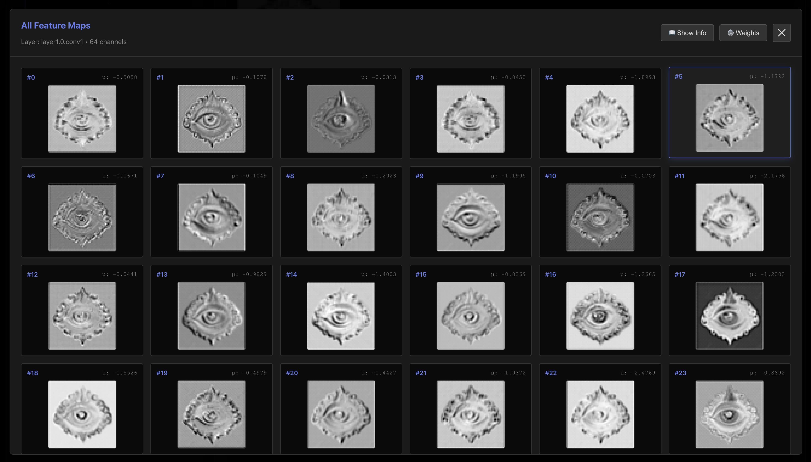
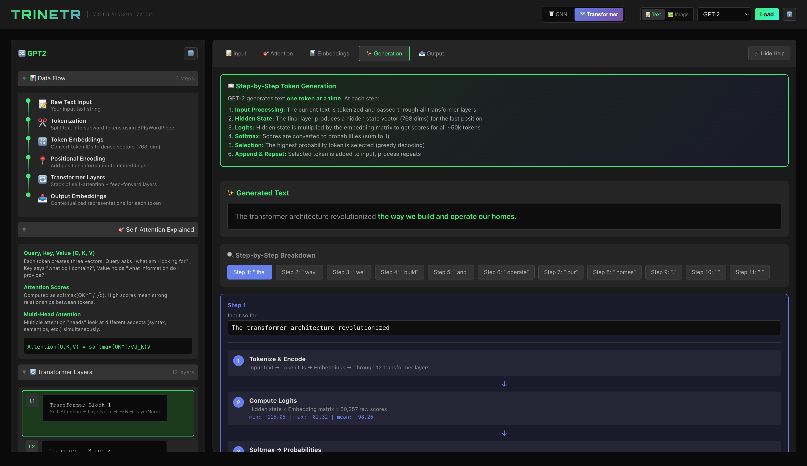
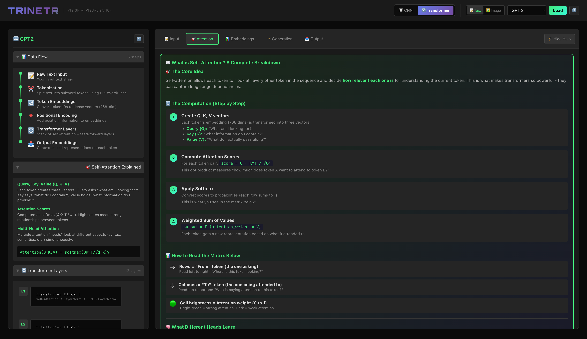
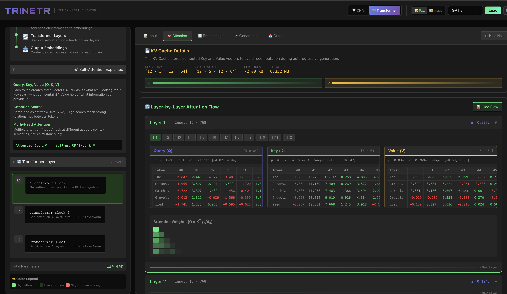

# Trinetr - Neural Network Visualization Platform

An interactive visualization platform for understanding deep learning models - from CNNs to Transformers.

> *Trinetr (त्रिनेत्र)* - The third eye that sees beyond the surface

> [Join our Discord community](https://discord.gg/y38UP9Q6A)

## What is this?

A tool to visualize and understand how neural networks work internally. Watch data flow through layers, see attention patterns, explore embeddings, and understand what your model is actually learning.

## Screenshots

### CNN Workspace
Full CNN visualization with model architecture, image preprocessing, activation maps, and predictions.


### Feature Maps
Explore all 64 channels of a convolutional layer to see what features the network detects.



### Transformer - Text Generation
Step-by-step token generation with GPT-2, showing the complete data flow and generation process.



### Self-Attention Explained
Understand how self-attention works with Q, K, V vectors and attention score computation.



### Layer-by-Layer Attention Flow
Deep dive into attention with KV cache details, actual Q/K/V values, and per-head attention weights.



## Features

### 🖼️ CNN Visualization
- **Model Architecture**: Interactive layer-by-layer view of CNN structure
- **Image Preprocessing**: Real-time kernel visualization (blur, sharpen, edge detection)
- **Custom Kernels**: Modify convolution kernels and see immediate effects
- **Activation Maps**: Visualize feature maps at each layer
- **Supported Models**: VGG16, VGG19, ResNet18, ResNet50, DenseNet121

### 🤖 Transformer Visualization
- **Text Models**: GPT-2, BERT - see how language models process text
- **Vision Models**: ViT (Vision Transformer) - understand image classification
- **Attention Visualization**: 
  - Multi-head attention matrices with real values
  - Q, K, V weight matrices and their computation
  - Layer-by-layer attention flow
- **QKV Deep Dive**:
  - Actual Q, K, V values for each token/patch
  - Statistics (mean, std, min, max)
  - Scrollable value tables
- **KV Cache**: Shape, size, and memory usage visualization
- **Token Embeddings**: See how inputs become vectors
- **Next Token Prediction**: Step-by-step generation process

### 🎨 Diffusion Model Visualization
- **Text-to-Image Generation**: Stable Diffusion models for creating images from text
- **Step-by-Step Denoising**: Watch the image emerge from noise through each denoising step
- **Latent Space Visualization**: See how images are represented in compressed latent space
- **Interactive Generation**: 
  - Adjust inference steps, guidance scale, and seed
  - View intermediate images at each step
  - Monitor latent space statistics (mean, std, min, max)
- **Educational Explanations**:
  - Forward and reverse diffusion process
  - U-Net architecture and noise prediction
  - VAE encoding/decoding
  - Classifier-free guidance mechanism
- **Supported Models**: Stable Diffusion v1.4, v1.5, v2.1

### ⚡ State Space Model Visualization
- **Efficient Sequence Processing**: Mamba models with linear O(n) complexity
- **State Space Equations**: Understand how continuous-time equations process sequences
- **Selective State Spaces**: Learn how Mamba's selective mechanism works
- **Interactive Inference**:
  - Run text inference and see predictions
  - View hidden states at each layer
  - Monitor state evolution through the model
- **Educational Explanations**:
  - State space equations (dx/dt = Ax + Bu)
  - Linear vs quadratic complexity comparison
  - Selective state spaces (Mamba's innovation)
  - How state space models differ from transformers
- **Supported Models**: Mamba 130M, 370M, 790M
- **Note**: State space models may require `mamba-ssm` package which has complex build requirements (CUDA/nvcc). The UI will work for visualization even if models can't be loaded - you can still learn the concepts!

## Architecture

```
┌─────────────────────────────────────────────────────────┐
│                    React Frontend                        │
│  ┌─────────────┐  ┌─────────────┐  ┌─────────────────┐  │
│  │ CNN Workspace│  │Transformer  │  │ Model Loader   │  │
│  │             │  │ Workspace   │  │                │  │
│  └─────────────┘  └─────────────┘  └─────────────────┘  │
└─────────────────────────────────────────────────────────┘
                           │
                           ▼
┌─────────────────────────────────────────────────────────┐
│                  FastAPI Backend                         │
│  ┌─────────────┐  ┌─────────────┐  ┌─────────────────┐  │
│  │ PyTorch     │  │ HuggingFace │  │ Image Processing│  │
│  │ CNN Models  │  │ Transformers│  │ & Kernels       │  │
│  └─────────────┘  └─────────────┘  └─────────────────┘  │
└─────────────────────────────────────────────────────────┘
```

- **Backend**: Python FastAPI + PyTorch + HuggingFace Transformers
- **Frontend**: TypeScript + React + Vite

## Quick Start

```bash
# Clone and run
git clone <repo>
cd trinetr
./start.sh
```

The script will:
1. Set up Python environment
2. Install dependencies
3. Build the frontend
4. Start the server at http://localhost:8000

## Manual Setup

### Backend
```bash
cd backend
python -m venv venv
source venv/bin/activate
pip install -r requirements.txt
uvicorn main:app --reload --host 0.0.0.0 --port 8000
```

### Frontend (for development)
```bash
cd frontend
npm install
npm run dev
```

## Usage

1. **Select Model Type**: Choose CNN or Transformer from the dropdown
2. **Load a Model**: Pick from available pretrained models
3. **Provide Input**: Upload an image (CNN/ViT) or enter text (GPT-2/BERT)
4. **Explore**: Navigate through tabs to see different visualizations

### CNN Mode
- View model architecture on the left
- Use Image Lab to preprocess and apply kernels
- Run inference to see activations and predictions

### Transformer Mode
- **Input Tab**: See tokenization and embedding process
- **Attention Tab**: Explore attention patterns, QKV values, layer flow
- **Embeddings Tab**: Visualize token representations
- **Generation Tab**: Watch step-by-step token generation
- **Output Tab**: See final predictions with confidence scores

### Diffusion Mode
- **How It Works Tab**: Comprehensive explanation of diffusion models, forward/reverse diffusion, guidance, and latent space
- **Generate Tab**: Create images from text prompts with adjustable parameters
- **Process Tab**: View step-by-step denoising with intermediate images and latent statistics
- **Architecture Tab**: Explore U-Net, VAE, and text encoder components

### State Space Mode
- **How It Works Tab**: Detailed explanation of state space models, equations, and selective mechanisms
- **Inference Tab**: Run text inference and see top predictions with probabilities
- **Hidden States Tab**: Explore hidden states at each layer with statistics and sample values
- **Architecture Tab**: View state space block structure and model components

## Requirements

- Python 3.10+
- Node.js 18+
- 4GB+ RAM (8GB recommended for larger models)

## License

Apache 2.0
